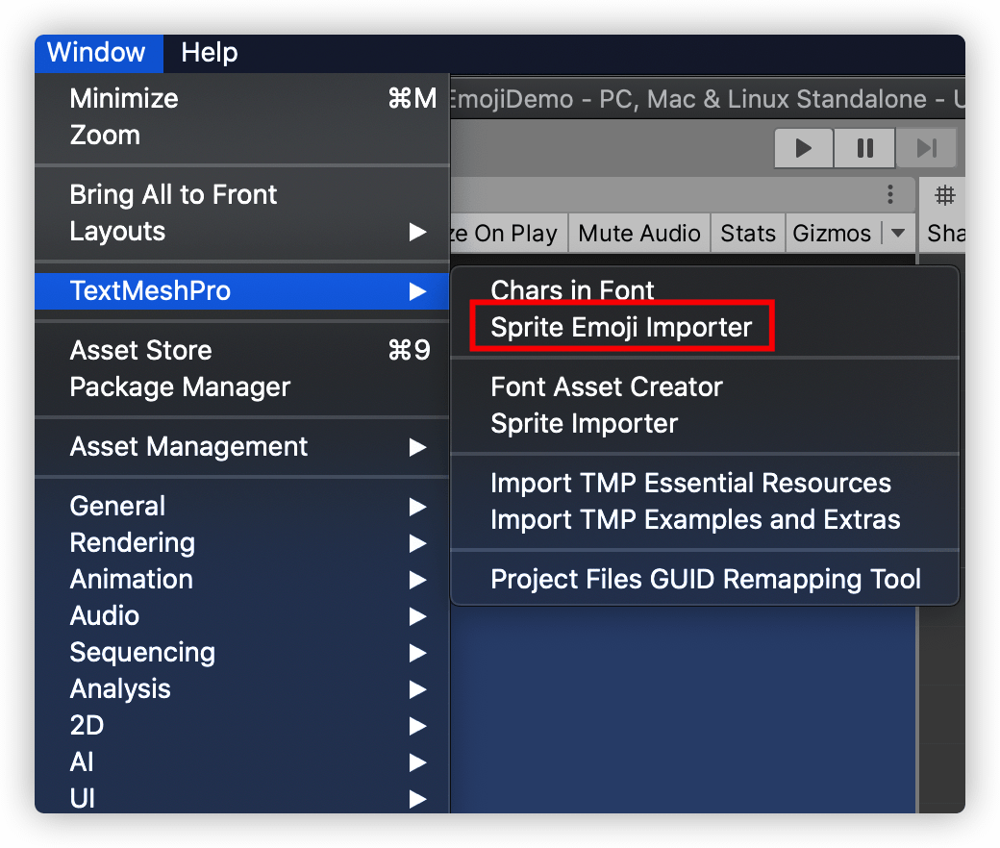
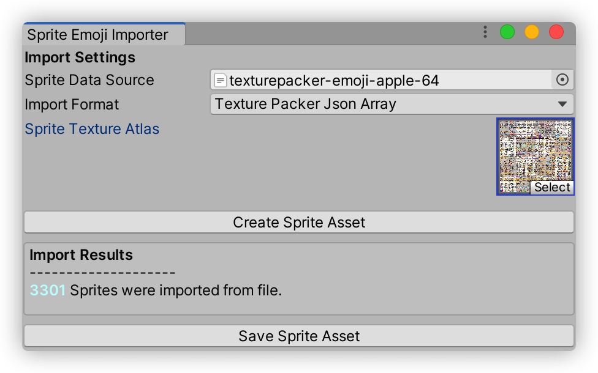
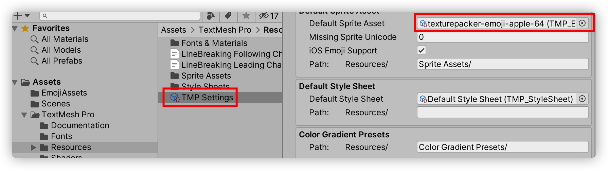
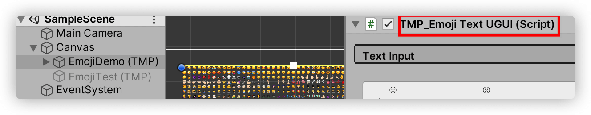

# Unity-UGUI-Emoji解决方案

## 参考资料

参考博客：

https://virtualcast.jp/blog/2019/10/emoji/

https://forum.unity.com/threads/full-emoji-support-api-emoji-sequen.660310/#post-4420162

Emoji图片资源：

https://github.com/iamcal/emoji-data

Emoji测试：

https://getemoji.com/

最全的Emoji：

https://unicode.org/emoji/charts/full-emoji-list.html

## 测试工程说明

在EmojiAssets下，存放了已经生成好的表情资源，目前覆盖度应该有90%以上。

该工具是基于TextMeshPro做的扩展，操作方式如下：

- 菜单栏点击Window-->TextMeshPro-->Sprite Emoji Inporter

- Import Format选择Texture Packer Json Array，Sprite Data Source选择TexturePacker导出json，Sprite Texture Atlas选择TexturePacker导出的图集，点击Create Sprite Asset，下面会显示导入了多少个表情，点击Save Sprite Asset将配置文件保存在本地。

  

- 在工程的TextMesh Pro文件夹下找到Resources里面有个TMP Settings，找到Default Sprite Asset，选择上面保存的配置文件

  

- 将场景里面的TextMeshPro脚本替换成TMP_Emoji Text UGUI

  

- 在输入框输入表情，进行测试。